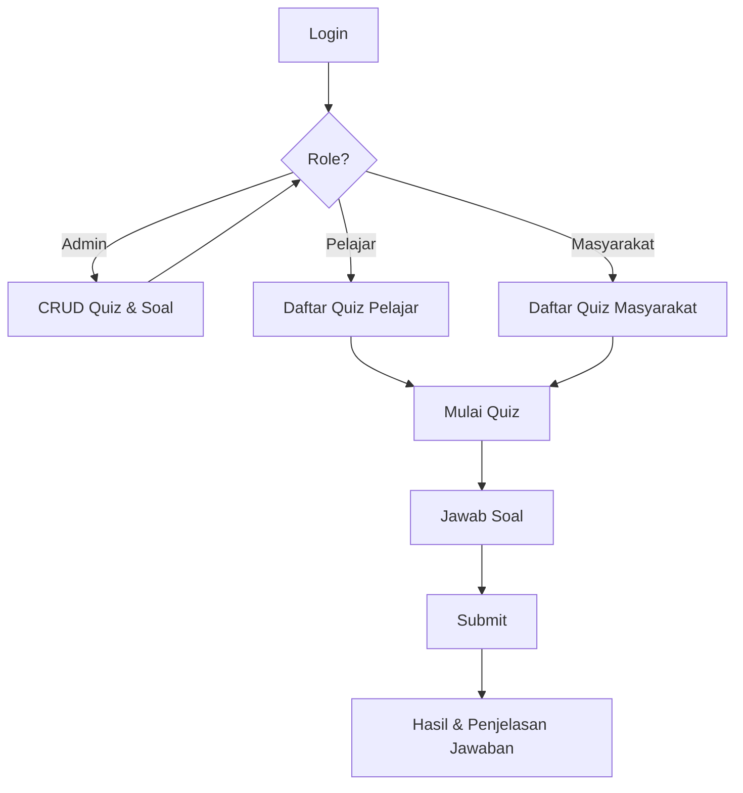

# 🎯 Laravel 10 Quiz App

Aplikasi quiz berbasis Laravel 10 dengan logika sesuai flowchart:
- **Login** pengguna
- **Role-based access** (Admin, Pelajar, Masyarakat)
- **Admin**: CRUD quiz & soal
- **Peserta** (Pelajar/Masyarakat): Mengerjakan quiz, submit jawaban, melihat hasil & penjelasan.

---

## 🚀 Fitur

### 👤 Autentikasi
- Login & register
- Role: `admin`, `pelajar`, `masyarakat`

### 🛠 Admin
- CRUD quiz
- Tambah soal & opsi jawaban
- Target quiz berdasarkan role peserta
- Melihat hasil quiz peserta

### 📚 Peserta
- Melihat daftar quiz sesuai role
- Mengerjakan quiz
- Submit jawaban
- Melihat hasil & penjelasan jawaban

---

## 🗄 Struktur Database

- **users** — Data pengguna & role
- **quizzes** — Data quiz
- **questions** — Pertanyaan
- **options** — Pilihan jawaban
- **quiz_attempts** — Riwayat pengerjaan quiz
- **user_answers** — Jawaban peserta

---

## 📂 Instalasi

1. **Clone Repository**
   ```bash
   git clone https://github.com/username/laravel-quiz-app.git
   cd laravel-quiz-app
````

2. **Install Dependencies**

   ```bash
   composer install
   npm install
   npm run dev
   ```

3. **Setup Environment**

   ```bash
   cp .env.example .env
   php artisan key:generate
   ```

   Edit file `.env` sesuai konfigurasi database Anda.

4. **Migrasi Database**

   ```bash
   php artisan migrate --seed
   ```

5. **Jalankan Server**

   ```bash
   php artisan serve
   ```

---

## 🔑 Akun Default (Seeder)

| Role       | Email                                                   | Password |
| ---------- | ------------------------------------------------------- | -------- |
| Admin      | [admin@example.com](mailto:admin@example.com)           | password |
| Pelajar    | [pelajar@example.com](mailto:pelajar@example.com)       | password |
| Masyarakat | [masyarakat@example.com](mailto:masyarakat@example.com) | password |

---

## 📌 Alur Logika (Flowchart)



---

## 🤝 Kontribusi

1. Fork repo ini
2. Buat branch baru: `feature/nama-fitur`
3. Commit perubahan Anda
4. Push ke branch
5. Buat pull request

---

## 📄 Lisensi

[MIT License](LICENSE)

```

---

```
